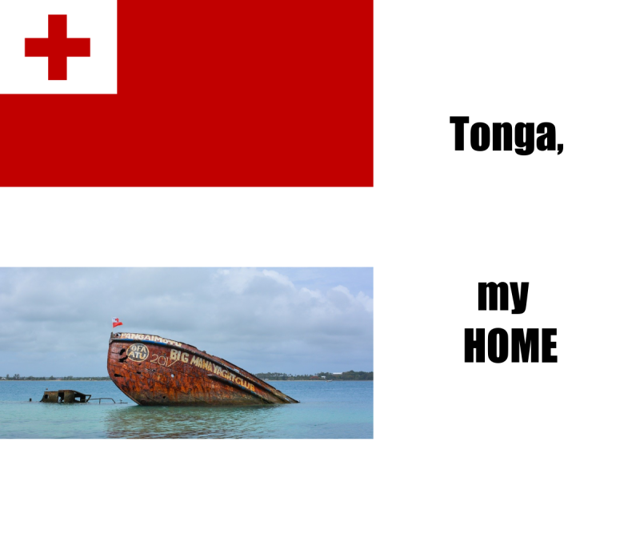

# Assignment 1, S1 2022 - *Creating HTML using modern technologies*

## 1. Meme:


## 2. R code:
```r
# square one
flag_tonga <- image_read("https://cdn.pixabay.com/photo/2012/04/11/15/44/flag-28596_1280.png") %>%
  image_scale(700)

# square two
tonga_text <- image_blank(width = 500,
                         height = 500,
                         color = "#FFFFFF") %>%
  image_annotate(text = "Tonga,",
                 color = "#000000",
                 size = 80,
                 font = "Impact",
                 gravity = "center")

# square three
boat_tonga <- image_read("https://cdn.pixabay.com/photo/2018/11/17/20/35/shipwreck-3821992_1280.jpg") %>%
  image_scale(700)

#square_four
ml_text <- image_blank(width = 500,
                       height = 500,
                       color = "#FFFFFF") %>%
  image_annotate(text = "my \n HOME",
                 color = "#000000",
                 size = 80,
                 font = "Impact",
                 gravity = "north")

# making each row

# first using one approach
tonga_vector <- c(flag_tonga, tonga_text)
top_row <- image_append(tonga_vector)

# second using a different approach
bottom_row <- image_append(c(boat_tonga, ml_text))

#making the whole thing!

# using another approach
meme <- c(top_row, bottom_row) %>%
  image_append(stack = TRUE) %>%
  image_scale(800)
```

## 3. Information:
- *what the motivation was?*
- *how your meme is new/original?*

The motivation for the meme I have created is my beautiful island, **Tonga**. Due to the current ongoing pandemic that we are facing globally, it has been extremely difficult being away for so long. My meme is new/original because it reflects who I am. I am Tongan, and Tonga is my home. I have adapted an existing meme format (four squares) as I believe the images I have used tell more than my words. 
